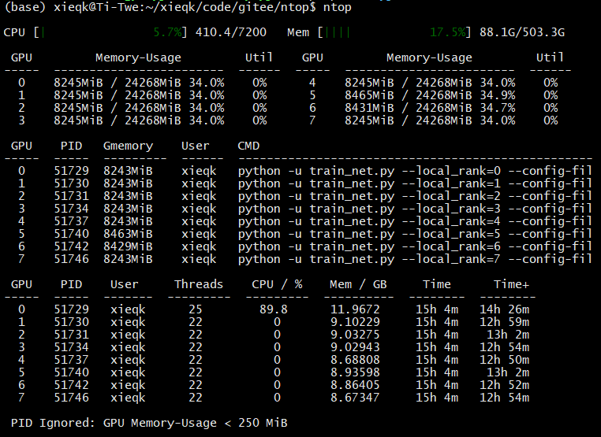

# ntop: Nvidia Top

### 介绍
将 nvidia-smi 和 top 整合于一个命令，查看正在使用GPU的进程，并整理输出。

输出内容包括：

顶部：CPU 及内存占用情况（绿色：占用低，蓝色：中等，红色：占用高）

- CPU 占用量/率 
- 内存 占用量/率

表一：nvidia-smi 输出信息的上半部分

- 每个 GPU 卡的显存占用量/率和计算资源占用率

表二：nvidia-smi 输出信息的下半部分

- 每个卡上占用进程，及 PID、显存占用、用户名和进程使用命令

表三：通过进程 PID 在 top 输出中查询到的相关信息

- 每个主进程的 PID、用户名、线程数、CPU占用率（一核为100%），真实运行时间，CPU时间

示例图如下：



### 安装依赖

1.  psutil
2.  tabulate
3.  pyinstaller

Conda 安装

```bash
conda install -c conda-forge psutil tabulate pyinstaller
```

Pip 安装
```bash
pip install -i https://opentuna.cn/pypi/web/simple psutil tabulate pyinstaller
```

### 构建可执行程序

其中带3090表示支持3090显卡，不带表示支持30系以前代的显卡。

```bash
# -F 打包成单个文件，-n 指定输出名字
pyinstaller -F ntop.py -n ntop
pyinstaller -F ntop-3090.py -n ntop
```

### 添加环境变量

打包后，可在 `dist` 文件夹中找到可执行程序。将该可执行程序所在目录加入环境变量，即可直接在命令行使用 `ntop` 查看当前 GPU 使用情况。

下例中已将该可执行程序复制到了 `Home` 目录下的 `bin` 文件夹中(`~/bin`)，然后将该目录添加进环境变量如下（一次性）。

```bash
export PATH=$PATH:~/bin
```

也可将上述语句加入 `~/.bashrc` 文件的末尾，即可在每次登录时均将 `~/bin` 目录加入用户环境变量。

由于程序用使用了颜色输出，在通过 `watch` 命令持续监控时需要加 `--color` 参数，如：

```bash
# 每一秒输出一次：-n 1
watch --color -n 1 ntop
```
